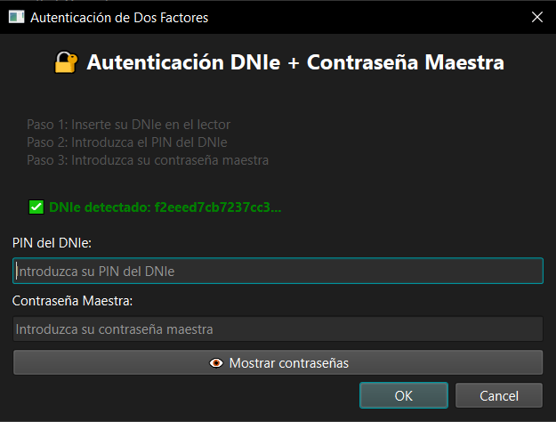
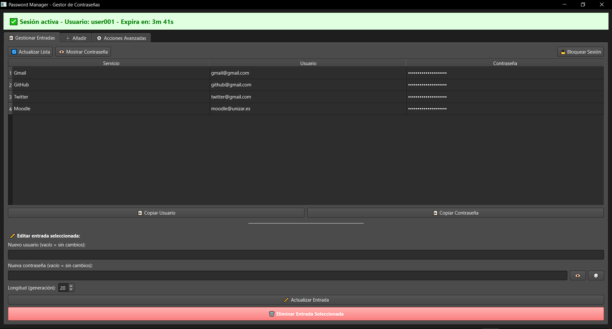
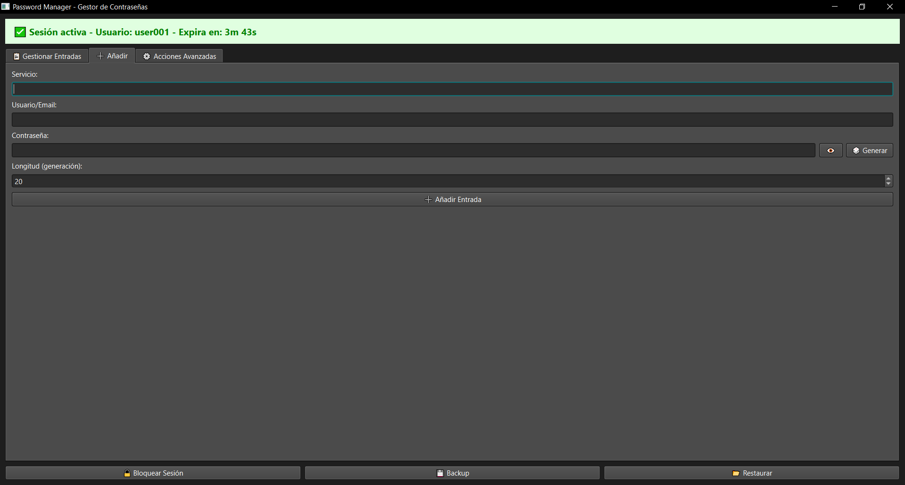

# 🔐 DNIe Password Manager

[](https://github.com/D-MSol4/password-manager-dnie/releases/latest)
[](https://github.com/D-MSol4/password-manager-dnie/releases)

Gestor de contraseñas seguro con autenticación de dos factores mediante DNIe español (Documento Nacional de Identidad electrónico) y contraseña maestra.

## 🚀 Descarga Rápida

**¿Solo quieres usar la aplicación sin instalar Python?** Descarga los ejecutables precompilados:

📥 **[Descargar Última Versión](https://github.com/D-MSol4/password-manager-dnie/releases/latest)**

- **Interfaz Gráfica (Recomendado)**: `password_manager_gui.exe` - Aplicación con ventanas e interfaz visual
- **Línea de Comandos**: `password_manager_cli.exe` - Versión CLI para usuarios avanzados

> ⚠️ **Requisito**: Debes tener [OpenSC instalado](https://github.com/OpenSC/OpenSC/releases) para que los ejecutables funcionen.

## 📋 Tabla de Contenidos

- [Descripción](#descripción)
- [Características](#características)
- [Arquitectura de Seguridad](#arquitectura-de-seguridad)
- [Requisitos del Sistema](#requisitos-del-sistema)
- [Instalación](#instalación)
- [Uso](#uso)
- [Estructura del Proyecto](#estructura-del-proyecto)
- [Tecnologías Utilizadas](#tecnologías-utilizadas)
- [Capturas de Pantalla](#capturas-de-pantalla)
- [Roadmap](#roadmap)
- [Licencia](#licencia)

## 📖 Descripción

DNIe Password Manager es un gestor de contraseñas de alta seguridad que implementa autenticación de dos factores (2FA) utilizando el **DNIe español** como primer factor y una **contraseña maestra** como segundo factor. La aplicación protege tus credenciales mediante cifrado robusto y prácticas de seguridad avanzadas.

### ¿Por qué este proyecto?

- **Seguridad máxima**: Combina criptografía de hardware (DNIe) con contraseña maestra
- **Privacidad**: Tus contraseñas nunca salen de tu ordenador
- **Cumplimiento**: Usa el DNIe, documento oficial español con certificado digital
- **Open Source**: Código auditable y transparente

## ✨ Características

### Seguridad

- ✅ **Autenticación de dos factores (2FA)**
  - Factor 1: Firma criptográfica con DNIe (PKI hardware)
  - Factor 2: Contraseña maestra con Argon2id
- ✅ **Cifrado robusto**
  - Base de datos cifrada con Fernet (AES-128-CBC + HMAC-SHA256)
  - Derivación de claves con Argon2id (memory-hard KDF)
  - HKDF para combinación segura de claves
  - Rotación automática de claves de base de datos al cerrar sesión
- ✅ **Protección en memoria**
  - Desencriptación on-demand (base de datos solo se desencripta temporalmente)
  - Memory locking con `mlock()` para prevenir swap
  - Limpieza segura de memoria con `zeroize()`
- ✅ **Sesiones seguras**
  - Timeout automático por inactividad (4 minutos por defecto)
  - Re-autenticación obligatoria tras expiración
- ✅ **Eliminación segura**
  - Sobreescritura de archivos antes de borrado (3 pases)
  - Permisos restrictivos en archivos sensibles

### Funcionalidades

- 📝 **Gestión completa de contraseñas**
  - Añadir, editar, eliminar y listar entradas
  - Generador de contraseñas seguras (16-60 caracteres)
  - Copiar al portapapeles
- 🖥️ **Doble interfaz**
  - GUI moderna con PyQt6
  - CLI para uso avanzado y scripts
- 💾 **Backup y restauración**
  - Copia de seguridad manual
  - Restauración desde backup
- 🔑 **Gestión de credenciales**
  - Cambio de contraseña maestra
  - Reinicialización de base de datos
  - Destrucción segura de datos
- 👥 **Multi-usuario**
  - Soporte para múltiples DNIes
  - Base de datos independiente por usuario

## 🔒 Arquitectura de Seguridad


### Capas de Cifrado


### Protección en Memoria

La base de datos **NO permanece desencriptada en memoria**. Cada operación:

1. Desencripta BD → 2. Lee/Escribe datos → 3. Re-encripta BD → 4. Limpia memoria

Solo la clave `K_db` permanece en memoria durante la sesión activa, protegida con:
- `bytearray` mutable para sobreescritura
- `mlock()` para evitar swap a disco
- `zeroize()` para limpieza criptográfica al cerrar

### Rotación Automática de Claves

El sistema implementa **rotación automática de la clave de base de datos** (`K_db`) cada vez que se cierra sesión, siguiendo el principio de *forward secrecy*:

**Proceso de rotación:**

1. **Al cerrar sesión** → Se genera una nueva `K_db` aleatoria
2. **Re-encriptación** → Toda la base de datos se desencripta con la clave antigua y se re-encripta con la nueva
3. **Wrapping seguro** → La nueva `K_db` se envuelve con `K_wrap` (DNIe + contraseña)
4. **Limpieza** → La clave antigua se elimina de memoria con `zeroize()`

**Beneficios de seguridad:**

- 🔒 **Forward secrecy**: Si una clave antigua se compromete, no afecta a sesiones futuras
- 🔄 **Renovación periódica**: Las claves se renuevan con cada sesión
- 🛡️ **Protección adicional**: Mitiga ataques de recuperación de claves antiguas del disco

**Nota**: Este proceso es completamente transparente para el usuario y no requiere intervención manual.

## 🖥️ Requisitos del Sistema

### Sistema Operativo

- ✅ **Windows** 10/11 (Testeado)
- ? **Linux** (Sin testear)
- ? **macOS** (Sin testear)

### Hardware

- 📟 **Lector de tarjetas inteligentes** compatible con DNIe
- 💳 **DNIe español** (versión 3.0 o superior recomendada)

### Software Base

#### OpenSC (Obligatorio)

OpenSC proporciona la biblioteca PKCS#11 necesaria para comunicarse con el DNIe.

**Windows:**
Descargar e instalar desde:
https://github.com/OpenSC/OpenSC/releases

Ruta por defecto:
C:\Program Files\OpenSC Project\OpenSC\pkcs11\opensc-pkcs11.dll


**Linux (Ubuntu/Debian):**
sudo apt-get update
sudo apt-get install opensc-pkcs11 pcscd

Ruta de biblioteca:
/usr/lib/x86_64-linux-gnu/opensc-pkcs11.so


**macOS:**
brew install opensc

Ruta de biblioteca:
/usr/local/lib/opensc-pkcs11.so


#### Python

- **Python 3.8+** (recomendado 3.10 o superior)

## 📦 Instalación

### 1. Clonar el Repositorio

git clone https://github.com/tu-usuario/dnie-password-manager.git
cd dnie-password-manager


### 2. Crear Entorno Virtual

Linux/macOS
python3 -m venv venv
source venv/bin/activate

Windows
python -m venv venv
venv\Scripts\activate


### 3. Instalar Dependencias

pip install -r requirements.txt


### 4. Verificar Instalación

Verificar que OpenSC está instalado
Linux/macOS
pkcs11-tool --list-slots

Windows
"C:\Program Files\OpenSC Project\OpenSC\tools\pkcs11-tool.exe" --list-slots


## 🚀 Uso

### Interfaz Gráfica (GUI)

python interfaz.py


**Primera ejecución:**
1. Inserta tu DNIe en el lector
2. La aplicación detectará automáticamente el DNIe
3. Si no está registrado, se iniciará el proceso de inicialización:
   - Introduce el PIN del DNIe
   - Crea una contraseña maestra (16-60 caracteres)
   - Confirma la contraseña maestra
4. ¡Listo! Ya puedes gestionar tus contraseñas

**Uso normal:**
1. Inserta tu DNIe
2. Introduce PIN del DNIe
3. Introduce contraseña maestra
4. Gestiona tus contraseñas desde la interfaz

### Interfaz de Línea de Comandos (CLI)

python main.py


**Comandos disponibles:**

Añadir una entrada
pm> add gmail usuario@gmail.com

Listar todas las entradas
pm> list

Mostrar una entrada específica
pm> show gmail

Copiar contraseña al portapapeles
pm> copy gmail

Editar una entrada
pm> edit gmail

Eliminar una entrada
pm> delete gmail

Hacer backup
pm> backup

Restaurar desde backup
pm> restore

Bloquear sesión
pm> lock

Ayuda
pm> help

Salir
pm> exit


## 📁 Estructura del Proyecto
```
dnie-password-manager/
│
├── data/                              # Directorio de datos (creado automáticamente)
│   ├── dnie_registry.json            # Registro de DNIes
│   ├── passwords_user001.db          # Base de datos cifrada
│   ├── passwords_backup_user001.db   # Backup de BD
│   ├── db_salt_user001.bin          # Salt para Argon2id
│   └── wrapped_key_user001.bin       # K_db envuelta
│
├── main.py                            # CLI principal
├── interfaz.py                        # GUI con PyQt6
├── smartcard_dnie.py                 # Interfaz con DNIe (PKCS#11)
├── crypto.py                          # Funciones criptográficas
├── database.py                        # Gestión de BD cifrada
├── requirements.txt                   # Dependencias Python
├── README.md                          # Este archivo
└── password_manager.log              # Log de errores
```


## 🛠️ Tecnologías Utilizadas

### Lenguajes y Frameworks

- **Python 3.8+** - Lenguaje principal
- **PyQt6** - Framework GUI

### Criptografía

- **cryptography** (≥42.0.0) - Primitivas criptográficas (Fernet, HKDF)
- **argon2-cffi** (≥23.1.0) - Derivación de claves con Argon2id
- **python-pkcs11** (≥0.7.0) - Interfaz con smart cards

### Seguridad en Memoria

- **zeroize** (≥0.1.0) - Limpieza segura de memoria
- **numpy** (≥2.0.0) - Soporte para arrays seguros

### Utilidades

- **pyperclip** (≥1.11.0) - Gestión del portapapeles

### Sistema

- **OpenSC** - Biblioteca PKCS#11 para DNIe

## 📸 Capturas de Pantalla

### Diálogo de Autenticación


### Ventana Principal


### Gestión de Entradas


## 🗺️ Roadmap

### Versión Actual (v1.0)

- ✅ Autenticación 2FA con DNIe
- ✅ Interfaz GUI y CLI
- ✅ Cifrado robusto y protección en memoria
- ✅ Multi-usuario

### Próximas Funcionalidades (v1.1)

- [ ] Importar/exportar contraseñas (formato cifrado)
- [ ] Categorías y etiquetas para entradas
- [ ] Búsqueda y filtrado avanzado
- [ ] Historial de cambios de contraseñas
- [ ] Generador con políticas personalizables
- [ ] Sincronización cifrada entre dispositivos

## 🤝 Contribuciones

Las contribuciones son bienvenidas. Por favor:

1. Fork el proyecto
2. Crea una rama para tu feature (`git checkout -b feature/AmazingFeature`)
3. Commit tus cambios (`git commit -m 'Add some AmazingFeature'`)
4. Push a la rama (`git push origin feature/AmazingFeature`)
5. Abre un Pull Request

### Reportar Bugs

Si encuentras un bug de seguridad, **NO** abras un issue público. Contacta directamente al autor.

## ⚠️ Advertencias de Seguridad

- 🔴 **Nunca compartas tu PIN del DNIe** con nadie
- 🔴 **La contraseña maestra no es recuperable** - guárdala en lugar seguro
- 🔴 **Haz backups regularmente** de tu base de datos
- 🔴 **No ejecutes el código en sistemas no confiables** (riesgo de keyloggers)
- 🟡 **Usa un antivirus actualizado** para proteger tu sistema

## 📄 Licencia

Este proyecto está bajo la Licencia MIT. Ver el archivo `LICENSE` para más detalles.

MIT License

Copyright (c) 2025 [Tu Nombre]

Permission is hereby granted, free of charge, to any person obtaining a copy
of this software and associated documentation files (the "Software"), to deal
in the Software without restriction...


## 👤 Autor

**Daniel Modrego & Ana Lushan Montuenga**

- GitHub: [@D-MSol4](https://github.com/D-MSol4)
- GitHub: [@AnaMontuenga](https://github.com/AnaMontuenga)

## 🙏 Agradecimientos

- [OpenSC Project](https://github.com/OpenSC/OpenSC) - Por la biblioteca PKCS#11
- [PyQt](https://www.riverbankcomputing.com/software/pyqt/) - Por el framework GUI
- [Cryptography](https://cryptography.io/) - Por las primitivas criptográficas
- Comunidad de Python y seguridad informática

---
